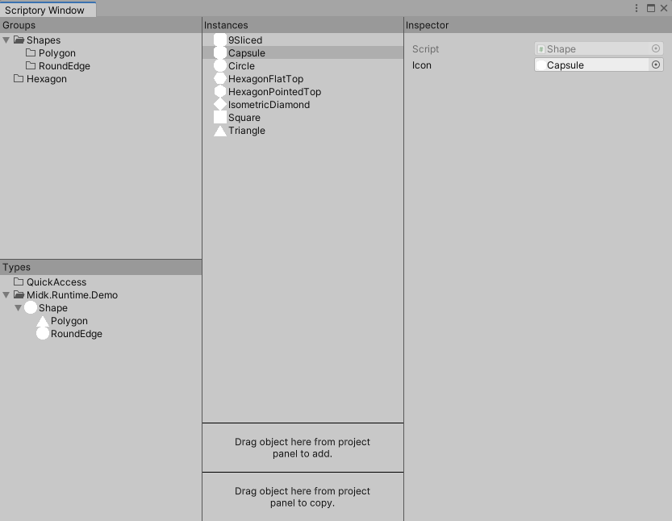
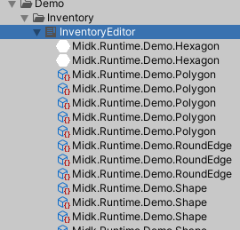
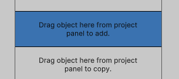
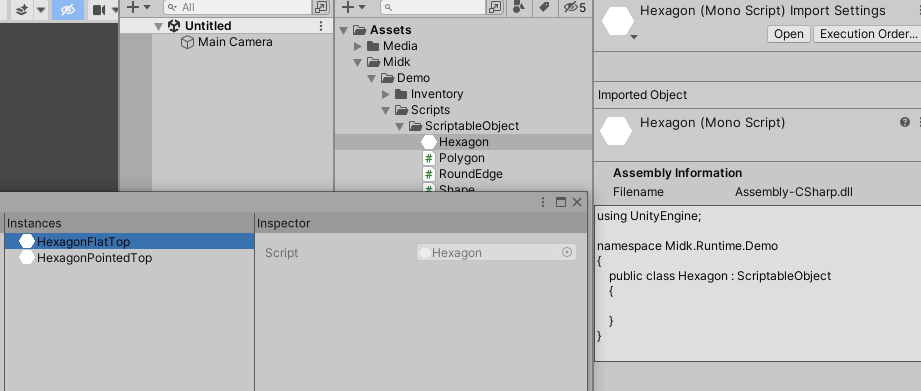
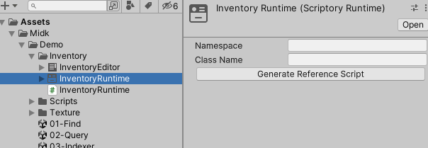

# 1 Scriptory Window

Project 窗口右键单击 > Create > Scriptory Editor 即可创建 ScriptoryEditor 资产，双击创建的 Asset 会打开 Scriptory Window 窗口。

**1. Groups**

用于显示当前的文件夹结构，右键菜单可添加新文件夹、改名、删除文件夹，左键按住可拖拽文件夹来移动位置。

**2. Types**

默认显示继承自 ScriptoryRuntime.Object 的类型，选中类型拖拽到 Instances 窗口会在选中的文件夹创建此类型的实例，创建的实例同时会保存为对应 ScriptoryEditor 资产的子资产。

右键菜单可刷新此列表，或者显示继承自 ScriptableObject 的类型，显示的列表包含继承自 ScriptoryRuntime.Object 的类型，这些类型同样可以通过拖拽到 Instances 窗口来创建实例。

> 选中继承自 ScriptoryRuntime.Object 的类型所在的 C# 文件，在 Inspector 窗口可设置默认 Icon，此处设置的图标会在 Types 窗口显示。
>
> 不要随意实例化不认识的继承自 ScriptableObject 的脚本，这可能导致编辑器或插件的设置被异常修改而报错。

**3. Instances**

显示选中的文件夹所包含的实例，在 Groups 窗口点击空白处可选中根文件夹。

右键菜单可删除实例、重命名、刷新、选中实例类型的脚本、选中实例。

左键可拖拽到 Groups 窗口上的文件夹以改变此实例的父文件夹，拖拽到 Groups 窗口的空白处会修改父文件夹为根文件夹。

左键可拖拽到可接收实例类型的变量字段上为变量赋值。

左键拖拽到此窗口里其它实例上可移动在此文件夹中的位置，鼠标弹起时会根据位置将拖动的实例移动到选中的实例之上或之下。

Instances 窗口最下方存在两个区域，可拖拽 Project 窗口中的资产到这两个区域来将其加入到 ScriptoryEditor 资产中。拖拽到 Add 区域会直接将拖拽的资产添加到 ScriptoryEditor 资产中，拖拽到 Copy 区域会将拖拽资产的复制添加到 ScriptoryEditor 资产中。这两个区域默认只接收继承自 ScriptableObject 的资产，可同时拖拽多个资产，拖拽的资产中包含可接收的资产时，对应的区域会变为蓝色，指针样式也会改变。不要通过此种方式添加包含子资产的资产。

>这两个区域的右键菜单的选项可设置接收的资产从继承自 ScriptableObject 的资产变为继承自 UnityEngine.Object 的资产，请谨慎使用此功能。
>
>
>
>

**4. Inspector**

显示的内容与编辑器里 Inspector 窗口的内容一致，因为 Unity 内置格式的原因，带有 Foldout 元素的部分排版会有些许差异。

右键菜单可选中实例类型的脚本、选中实例。

继承自 ScriptoryRuntime.Object 的类型通过在此窗口修改 Icon 的值，来修改 Instances 窗口中显示的图标，修改完后需在 Instances 窗口右键刷新来刷新图标。

继承自 ScriptableObject 的类型在 Instances 窗口会显示 Select Icon。

# 2 ScriptoryRuntime Asset

直接通过 ScriptoryEditor 资产来查找其中的资产会有一定的效率问题，而且可能会错误的使用一些用于 Scriptory Window 的方法。为了避免这些问题，不直接使用 ScriptoryEditor 资产，而是通过 ScriptoryEditor 生成 ScriptoryRuntime 资产，通过 ScriptoryRuntime 查找子资产效率最高，并且没有其它方法来干扰查找。

选中 ScriptoryEditor 资产，在 Inspector 窗口点击 Generate Runtime Asset 按钮会生成 ScriptoryRuntime 资产，点击 Generate Runtime Asset And Reference Script 按钮会生成 ScriptoryRuntime 资产和对应的子资产索引脚本

* Relative Path：为 true 时，根路径为当前 ScriptoryEditor 资产所在的路径，为 false 时，根路径为 Assets 文件夹。
* Assets Name：要创建的 ScriptoryRuntime 资产的名字。
* Namespace：要创建的资产索引类所在的命名空间。
* Class Name：要创建的资产索引脚本的名字。

选中 ScriptoryRuntime 资产，在 Inspector 窗口点击 Generate Reference Script 也会生成索引脚本。

**Demo 中生成的索引脚本**：

~~~c#
//------------------------------------------------------------------------------
// <auto-generated>
//     This code was auto-generated by Scriptory
//     version x.x
//     from Assets/Midk/Demo/Inventory/InventoryRuntime.asset
//
//     Changes to this file may cause incorrect behavior and will be lost if
//     the code is regenerated.
// </auto-generated>
//------------------------------------------------------------------------------

namespace MidkRuntime.Demo
{
    public class InventoryRuntime
    {
        public const int folder = 5;
        public class Foods
        {
            public const int folder = 3;
            public const long Bread = 12884901888;
            public const long Cheese = 12884901889;
            public const long Mushroom = 12884901890;
            public class Fruits
            {
                public const int folder = 0;
                public const long Apple = 0;
                public const long GreenApple = 1;
            }
            public class Meats
            {
                public const int folder = 1;
                public const long FishSteak = 4294967296;
                public const long Ham = 4294967297;
                public const long Meat = 4294967298;
            }
            public class Drinks
            {
                public const int folder = 2;
                public const long Beer = 8589934592;
                public const long Wine = 8589934593;
                public const long Wine2 = 8589934594;
            }
        }
        public class Potions
        {
            public const int folder = 4;
            public const long Potion = 17179869184;
        }
    }
}
~~~

## 2.1 子资产查找

在脚本中引用 ScriptoryRuntime 资产，然后通过此资产查找子资产。

可通过路径、类型、名称、索引等多种方式查找子资产。

**1. 公共属性**

ScriptoryRuntime：

~~~c#
public Folder Root; // 根文件夹
~~~

ScriptoryRuntime.Folder：

~~~c#
public int Index; // 文件夹索引，无用，可忽略
public string Name; // 文件夹名称
public List<Folder> ChildFolderList; // 子文件夹
public List<ScriptableObject> ChildObjectList; // 子资产，不包含子文件夹下的资产
~~~

**2. 通过路径查找**

通过路径查找文件夹：

* 从根文件夹查找：

  ~~~c#
  public ScriptoryRuntime.Folder ScriptoryRuntime.FindFolder(string path);
  public ScriptoryRuntime.Folder ScriptoryRuntime.Folder.FindFolder(string path);
  ~~~

* 从当前文件夹查找：

  ~~~c#
  public ScriptoryRuntime.Folder ScriptoryRuntime.Folder.FindFolderRelative(string path);
  ~~~

~~~c#
ScriptoryRuntime.Folder fruits = _Asset.FindFolder("Foods.Fruits");

ScriptoryRuntime.Folder foods = _Asset.FindFolder("Foods");
ScriptoryRuntime.Folder fruits = foods.FindFolderRelative("Fruits");
~~~

通过路径查找资产：

* 从根文件夹查找：

  ~~~c#
  public Object ScriptoryRuntime.FindObject(string path);
  public Object ScriptoryRuntime.Folder.FindObject(string path);
  ~~~

* 从当前文件夹查找：

  ~~~c#
  public Object ScriptoryRuntime.Folder.FindObjectRelative(string path);
  ~~~

~~~c#
Object apple = _Asset.FindObject("Foods.Fruits.Apple");
Object apple = _Asset.FindFolder("Foods").FindObject("Foods.Fruits.Apple");
Object apple = _Asset.FindFolder("Foods").FindObjectRelative("Fruits.Apple");
Object apple = _Asset.FindFolder("Foods.Fruits").FindObjectRelative("Apple");
~~~

**3. 通过类型和名称查找**

从根文件夹查找：

~~~c#
public List<T> ScriptoryRuntime.Query<T>(string name = null) where T : UnityEngine.Object;
public T ScriptoryRuntime.Q<T>(string name = null) where T : UnityEngine.Object;
~~~

从当前文件夹查找：

~~~c#
public List<T> ScriptoryRuntime.Folder.Query<T>(string name = null) where T : UnityEngine.Object;
public T ScriptoryRuntime.Folder.Q<T>(string name = null) where T : UnityEngine.Object;
~~~

其中 Query 为查询所有符合条件的对象，Q 为查找第一个符合条件的对象，当 name 为空时仅通过类型查找。

~~~c#
List<Food> foods = _Asset.Query<Food>();
Food apple = _Asset.Q<Food>("Apple");
List<Food> fruits = _Asset.FindFolder("Foods.Fruits").Query<Food>();
~~~

**4. 通过索引查找**

查找文件夹：

~~~c#
ScriptoryRuntime.Folder foods = _Asset[InventoryRuntime.Foods.folder];
ScriptoryRuntime.Folder fruits = _Asset[InventoryRuntime.Foods.Fruits.folder];
~~~

查找子资产对象：

~~~c#
Food bread = _Asset[InventoryRuntime.Foods.Bread] as Food;
Food apple = _Asset[InventoryRuntime.Foods.Fruits.Apple] as Food;
~~~

> 此方法无查询消耗。

