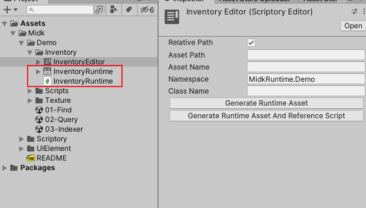
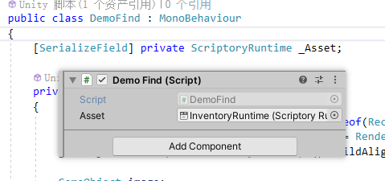

# 1 Visualized

## 1.1 Asset

Create a ScriptoryEditor asset through path `Project window right-click > Create > Scriptory Editor`，Double clicking on the created asset will open the Scriptory Window.

Finding sub assets directly through ScriptoryEditor assets can have certain efficiency issues, and may result in incorrect use of methods for ScriptoryWindow. To avoid these issues, instead of directly using ScriptoryEditor assets, generate ScriptoryRuntime assets through ScriptoryEditor assets.

Select the ScriptoryEditor asset, click the Generate Runtime Asset button in the Inspector window to generate the ScriptoryRuntime asset, click the Generate Runtime Asset And Reference Script button to generate the ScriptoryRuntime asset and corresponding sub asset index script. The sub asset index script is only used for index lookup, and the index script generated in the demo can be viewed at the end of the manual.

* Relative Path: When true, the root path is the path where the current ScriptoryEditor asset is located. When false, the root path is the Assets folder.
* Asset Path: The path after the root path, which does not contain a name.
* Asset Name: The name of the ScriptoryRuntime asset to be created. If it is empty, the corresponding name will be generated according to the name of the ScriptoryEditor asset.
* Namespace: The namespace of the subasset index class to create, which is passed to the created ScriptoryRuntime asset.
* Class Name: The name of the subasset index script to create, which will be passed to the ScriptoryRuntime asset created.

Select the ScriptoryRuntime asset and click Generate Reference Script in the Inspector window to also generate an index script.

## 1.2 Window

Double clicking on the ScriptoryEditor asset will open the Scriptory Window.

**1. Groups**

Used to display the current folder structure. The right-click menu allows for adding new folders, renaming, and deleting folders. Left click and hold can drag and drop folders to move locations.

**2. Types**

The default display is the type inherited from ScriptoryRuntime.Object. Dragging the selected type to the Instances window will create an instance of this type in the selected folder. The created instance will also be saved as a child asset of the corresponding ScriptoryEditor asset.

The right-click menu can refresh this list or display types that inherit from ScriptableObject. Do not instantiate unknown scripts that inherit from ScriptableObject, as this may cause the settings of the editor or plug-in to be modified abnormally and an error will be reported.

Select the C# file where the type inherited from ScriptoryRuntime.Object is located. You can set the default Icon in the Inspector window, and the icon set here will be displayed in the Types window.

Right-click on a type, and the pop-up menu contains the function to add this type to the QuickAccess folder.

**3. Instances**

Display the instances contained in the selected folder, click the blank space in the Groups window to select the root folder.

The right-click menu can delete the instance, rename, refresh, select the script of the instance type, and select the instance.

Left-click and drag to the folder on the Groups window to change the parent folder of this instance, dragging to the blank space of the Groups window will modify the parent folder to be the root folder.

Left-click and drag to the variable field that can receive this instance type to assign a value to the variable. Because ScriptoryEditor will make a copy of all sub-assets when generating ScriptoryRuntime, and ScriptoryEditor assets will not be packaged into the game, so don't directly reference Scriptory subassets outside of Scriptory assets.

Left-click and drag to other instances in this window to move the position in this folder. When the mouse pops up, the dragged instance will be moved above or below the selected instance according to the position.

There are two areas at the bottom of the Instances window, and assets in the Project window can be dragged to these two areas to add them to the ScriptoryEditor assets. Dragging to the Add area will directly add the dragged asset to the ScriptoryEditor asset, and dragging to the Copy area will add the copy of the dragged asset to the ScriptoryEditor asset.

By default, these two areas only accept assets inherited from ScriptableObject, and multiple assets can be dragged and dropped. When the dragged assets include receivable assets, the corresponding area will turn blue, and the pointer style will also change. Do not add assets that contain subassets this way.

The right-click menu options in these two areas can set the received assets from assets inherited from ScriptableObject to assets inherited from UnityEngine.Object, please use this function with caution.

**4. Inspector**

The displayed content is consistent with the content of the Inspector window in the editor. Because of Unity's built-in format, some layouts with Foldout elements will be slightly different.

Right-click menu can select the script of the instance type and select the instance.

The type inherited from ScriptoryRuntime.Object can modify the icon displayed in the Instances window by modifying the value of Icon in this window. After the modification, you need to right click on the Instances window to refresh the icon.

Types inherited from ScriptableObject will display a Select Icon in the Instances window.

# 2 Coded

Reference the ScriptoryRuntime asset in your script, and use this asset to find subassets.

Sub-assets can be searched by various methods such as path, type, name, and index.

**1. public property**

ScriptoryRuntime:

~~~c#
public Folder Root; // root folder
~~~

ScriptoryRuntime.Folder:

~~~c#
public int Index; // folder index, useless, can be ignored
public string Name; // folder name
public List<Folder> ChildFolderList; // subfolder list
public List<ScriptableObject> ChildObjectList; // Sub-assets, excluding assets under subfolders
~~~

**2. find by path**

find folder by path:

* find from root folder:

  ~~~c#
  public ScriptoryRuntime.Folder ScriptoryRuntime.FindFolder(string path);
  public ScriptoryRuntime.Folder ScriptoryRuntime.Folder.FindFolder(string path);
  ~~~

* find from current folder:

  ~~~c#
  public ScriptoryRuntime.Folder ScriptoryRuntime.Folder.FindFolderRelative(string path);
  ~~~

~~~c#
ScriptoryRuntime.Folder polygon = _Asset.FindFolder("Shapes.Polygon");

ScriptoryRuntime.Folder shapes = _Asset.FindFolder("Shapes");
ScriptoryRuntime.Folder polygon = shapes.FindFolderRelative("Polygon");
~~~

Find assets by path:

* find from root folder:

  ~~~c#
  public Object ScriptoryRuntime.FindObject(string path);
  public Object ScriptoryRuntime.Folder.FindObject(string path);
  ~~~

* find from current folder:

  ~~~c#
  public Object ScriptoryRuntime.Folder.FindObjectRelative(string path);
  ~~~

~~~c#
Polygon triangle = _Asset.FindObject("Shapes.Polygon.Triangle") as Polygon;
Polygon triangle = _Asset.FindFolder("Shapes").FindObject("Shapes.Polygon.Triangle") as Polygon;
Polygon triangle = _Asset.FindFolder("Shapes").FindObjectRelative("Polygon.Triangle") as Polygon;
Polygon triangle = _Asset.FindFolder("Shapes.Polygon").FindObjectRelative("Triangle") as Polygon;
~~~

**3. find by type and name**

find from root folder:

~~~c#
public List<T> ScriptoryRuntime.Query<T>(string name = null) where T : UnityEngine.Object;
public T ScriptoryRuntime.Q<T>(string name = null) where T : UnityEngine.Object;
~~~

find from current folder:

~~~c#
public List<T> ScriptoryRuntime.Folder.Query<T>(string name = null) where T : UnityEngine.Object;
public T ScriptoryRuntime.Folder.Q<T>(string name = null) where T : UnityEngine.Object;
~~~

The method Query is to query all eligible objects, and the method Q is to find the first eligible object. When the name is empty, it is only searched by type.

~~~c#
List<Shape> shapes = _Asset.Query<Shape>();
List<Shape> polygon = _Asset.FindFolder("Shapes.Polygon").Query<Shape>();
Shape triangle = _Asset.Q<Shape>("Triangle");
~~~

**4. find by index**

find folder:

~~~c#
ScriptoryRuntime.Folder shapes = _Asset[InventoryRuntime.Shapes.folder];
ScriptoryRuntime.Folder polygon = _Asset[InventoryRuntime.Shapes.Polygon.folder];
~~~

find subasset objects:

~~~c#
Shape triangle = _Asset[InventoryRuntime.Shapes.Polygon.Triangle] as Shape;
Shape circle = _Asset[InventoryRuntime.Shapes.Circle] as Shape;
~~~

> This method has no query cost.

**Index script generated in Demo**：

~~~c#
//------------------------------------------------------------------------------
// <auto-generated>
//     This code was auto-generated by Scriptory
//     version x.x
//     from Assets/Midk/Demo/Inventory/InventoryRuntime.asset
//
//     Changes to this file may cause incorrect behavior and will be lost if
//     the code is regenerated.
// </auto-generated>
//------------------------------------------------------------------------------

namespace Midk.Runtime.Demo
{
    public class InventoryRuntime
    {
        public const int folder = 4;
        public class Shapes
        {
            public const int folder = 2;
            public const long _9Sliced = 8589934592;
            public const long Capsule = 8589934593;
            public const long Circle = 8589934594;
            public const long HexagonFlatTop = 8589934595;
            public const long HexagonPointedTop = 8589934596;
            public const long IsometricDiamond = 8589934597;
            public const long Square = 8589934598;
            public const long Triangle = 8589934599;
            public class Polygon
            {
                public const int folder = 0;
                public const long HexagonFlatTop = 0;
                public const long HexagonPointedTop = 1;
                public const long IsometricDiamond = 2;
                public const long Square = 3;
                public const long Triangle = 4;
            }
            public class RoundEdge
            {
                public const int folder = 1;
                public const long _9Sliced = 4294967296;
                public const long Capsule = 4294967297;
                public const long Circle = 4294967298;
            }
        }
        public class Hexagon
        {
            public const int folder = 3;
            public const long HexagonFlatTop = 12884901888;
            public const long HexagonPointedTop = 12884901889;
        }
    }
}
~~~
