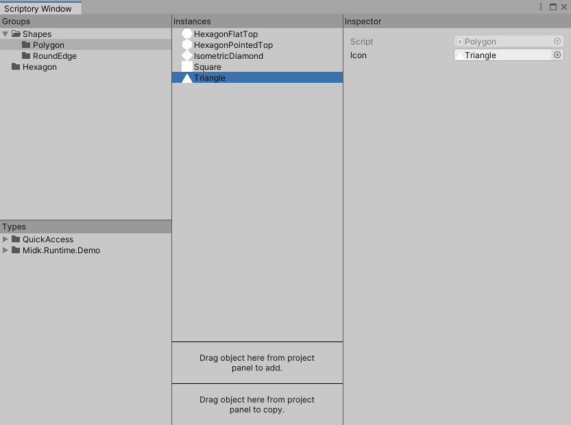
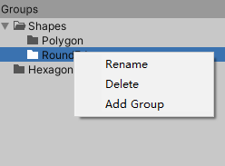
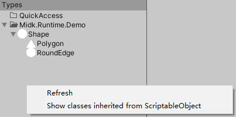
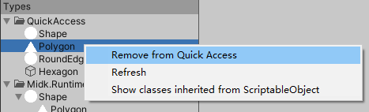
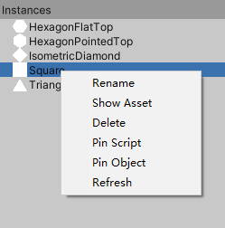
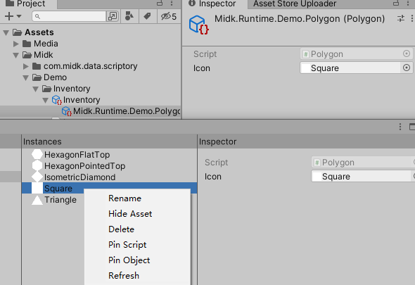
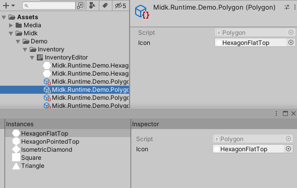

# 1 Visualized

## 1.1 Asset

在 Project 的右键菜单中点击 Create > Scriptory 即可创建 Scriptory 资产，双击创建的 Asset 会打开 Scriptory Window 窗口。

选中 Scriptory 资产，在 Inspector 窗口点击 Generate Reference Script 按钮会生成对应的子资产索引脚本。子资产索引脚本仅用于通过索引查找，手册末尾可查看 Demo 中生成的索引脚本。

* Namespace：要创建的子资产索引类所在的命名空间。
* Class Name：要创建的子资产索引脚本的名字。

## 1.2 Window

双击 Scriptory 资产会打开 Scriptory Window 窗口。

**1. Groups**

用于显示当前的文件夹结构，右键菜单可添加新文件夹、改名、删除文件夹，左键按住可拖拽文件夹来移动位置。

**2. Types**

默认显示继承自 ScriptoryObject 的类型，选中类型拖拽到 Instances 窗口会在选中的文件夹创建此类型的实例，创建的实例同时会保存为对应 Scriptory 资产的子资产。

右键菜单可刷新此列表，或者显示继承自 ScriptableObject 的类型，显示的列表包含继承自 ScriptoryObject 的类型，这些类型同样可以通过拖拽到 Instances 窗口来创建实例。

> 选中继承自 ScriptoryObject 的类型所在的 C# 文件，在 Inspector 窗口可设置默认 Icon，此处设置的图标会在 Types 窗口显示。
>
> 不要随意实例化不认识的继承自 ScriptableObject 的脚本，这可能导致编辑器或插件的设置被异常修改而报错。

在类型上右键单击可将此类型添加到 QuickAccess 文件夹。

在 QuickAccess 文件夹中的类型上右键单击可将此类型移除。

**3. Instances**

显示选中的文件夹所包含的游戏资产，在 Groups 窗口点击空白处可选中根文件夹。

右键菜单包含以下功能：

* 重命名。
* 在 Project 窗口显示或隐藏对应的子资产
* 删除对应子资产。
* 刷新。
* 选中资产类型对应的脚本。
* 选中资产，如果对应资产隐藏会使其先显示出来。

左键拖拽到 Groups 窗口上的文件夹以改变此实例的父文件夹，拖拽到 Groups 窗口的空白处会修改父文件夹为根文件夹，拖拽到能接收此实例类型的变量字段上可为变量赋值。

左键拖拽到此窗口里其它实例上可移动在此文件夹中的位置，鼠标弹起时会根据位置将拖动的实例移动到选中的实例之上或之下。

Instances 窗口最下方存在两个区域，可拖拽 Project 窗口中的资产到这两个区域来将其加入到 Scriptory 资产中。拖拽到 Add 区域会直接将拖拽的资产添加到 Scriptory 资产中，拖拽到 Copy 区域会将拖拽资产的复制添加到 Scriptory 资产中。这两个区域默认只接收继承自 ScriptableObject 的资产，可同时拖拽多个资产，拖拽的资产中包含可接收的资产时，对应的区域会变为蓝色，指针样式也会改变。不要通过此种方式添加包含子资产的资产。

这两个区域的右键菜单的选项可设置接收的资产从继承自 ScriptableObject 的资产变为继承自 UnityEngine.Object 的资产，请谨慎使用此功能。

**4. Inspector**

显示的内容与编辑器里 Inspector 窗口的内容一致，因为 Unity 内置格式的原因，带有 Foldout 元素的部分排版会有些许差异。

右键菜单可选中实例类型的脚本、选中实例。

继承自 ScriptoryObject 的类型通过在此窗口修改 Icon 的值，来修改 Instances 窗口中显示的图标，修改完后需在 Instances 窗口右键刷新来刷新图标。

继承自 ScriptableObject 的类型在 Instances 窗口会显示 Select Icon。

# 2 Coded

在脚本中引用 Scriptory 资产，然后通过此资产查找子资产。

可通过路径、类型、名称、索引等多种方式查找子资产。

**1. 公共属性**

Scriptory：

~~~c#
public ScriptoryGroup RootGroup; // 根文件夹
~~~

ScriptoryGroup：

~~~c#
public List<UnityEngine.Object> ChildObjectList; // 子资产，不包含子文件夹下的资产
~~~

**2. 通过路径查找**

通过路径查找文件夹：

* 从根文件夹查找：

  ~~~c#
  public ScriptoryGroup Scriptory.FindGroup(string path);
  public ScriptoryGroup ScriptoryGroup.FindGroup(string path);
  ~~~

* 从当前文件夹查找：

  ~~~c#
  public ScriptoryGroup ScriptoryGroup.FindGroupRelative(string path);
  ~~~

~~~c#
ScriptoryGroup polygon = m_Scriptory.FindGroup("Shapes.Polygon");

ScriptoryGroup shapes = m_Scriptory.FindGroup("Shapes");
ScriptoryGroup polygon = shapes.FindGroupRelative("Polygon");
~~~

通过路径查找资产：

* 从根文件夹查找：

  ~~~c#
  public Object Scriptory.FindObject(string path);
  public Object ScriptoryFolder.FindObject(string path);
  ~~~

* 从当前文件夹查找：

  ~~~c#
  public Object ScriptoryFolder.FindObjectRelative(string path);
  ~~~

~~~c#
Polygon triangle = m_Scriptory.FindObject("Shapes.Polygon.Triangle") as Polygon;
Polygon triangle = m_Scriptory.FindFolder("Shapes").FindObject("Shapes.Polygon.Triangle") as Polygon;
Polygon triangle = m_Scriptory.FindFolder("Shapes").FindObjectRelative("Polygon.Triangle") as Polygon;
Polygon triangle = m_Scriptory.FindFolder("Shapes.Polygon").FindObjectRelative("Triangle") as Polygon;
~~~

**3. 通过类型和名称查找**

从根文件夹查找：

~~~c#
public List<T> Scriptory.Query<T>(string name = null) where T : UnityEngine.Object;
public T Scriptory.Q<T>(string name = null) where T : UnityEngine.Object;
~~~

从当前文件夹查找：

~~~c#
public List<T> ScriptoryFolder.Query<T>(string name = null) where T : UnityEngine.Object;
public T ScriptoryFolder.Q<T>(string name = null) where T : UnityEngine.Object;
~~~

其中 Query 为查询所有符合条件的对象，Q 为查找第一个符合条件的对象，当 name 为空时仅通过类型查找。

~~~c#
List<Shape> shapes = m_Scriptory.Query<Shape>();
List<Shape> polygon = m_Scriptory.FindFolder("Shapes.Polygon").Query<Shape>();
Shape triangle = m_Scriptory.Q<Shape>("Triangle");
~~~

**4. 通过索引查找**

查找文件夹：

~~~c#
ScriptoryFolder shapes = m_Scriptory[Inventory.Shapes.index];
ScriptoryFolder polygon = m_Scriptory[Inventory.Shapes.Polygon.index];
~~~

查找子资产对象：

~~~c#
Shape triangle = m_Scriptory[Inventory.Shapes.Polygon.Triangle] as Shape;
Shape circle = m_Scriptory[Inventory.Shapes.Circle] as Shape;
~~~

**Demo 中生成的索引脚本**：

~~~c#
//------------------------------------------------------------------------------
// <auto-generated>
//     This code was auto-generated by Scriptory
//     version 2.0.0
//     from Assets/Midk/Demo/Inventory/Inventory.asset
//
//     Changes to this file may cause incorrect behavior and will be lost if
//     the code is regenerated.
// </auto-generated>
//------------------------------------------------------------------------------

namespace Midk.Runtime.Demo
{
    public class Inventory
    {
        public const int index = 0;
        public class Shapes
        {
            public const int index = 1;
            public const long _9Sliced = 0;
            public const long Capsule = 1;
            public const long Circle = 2;
            public const long HexagonFlatTop = 3;
            public const long HexagonPointedTop = 4;
            public const long IsometricDiamond = 5;
            public const long Square = 6;
            public const long Triangle = 7;
            public class Polygon
            {
                public const int index = 3;
                public const long HexagonFlatTop = 8;
                public const long HexagonPointedTop = 9;
                public const long IsometricDiamond = 10;
                public const long Square = 11;
                public const long Triangle = 12;
            }
            public class RoundEdge
            {
                public const int index = 4;
                public const long _9Sliced = 13;
                public const long Capsule = 14;
                public const long Circle = 15;
            }
        }
        public class Hexagon
        {
            public const int index = 2;
            public const long HexagonFlatTop = 16;
            public const long HexagonPointedTop = 17;
        }
    }
}
~~~
