# 1 Visualized

## 1.1 Asset

Click Create > Scriptory in the right-click menu of the Project to create a Scriptory asset, and double-click the created Asset to open the Scriptory Window window.

Select the Scriptory asset and click the Generate Reference Script button in the Inspector window to generate the corresponding sub-asset index script. The sub-asset index script is only used for searching through the index, and the index script generated in the Demo can be viewed at the end of the manual.

* Namespace：The namespace where the subasset index class to create resides.
* Class Name：The name of the subasset index script to create.

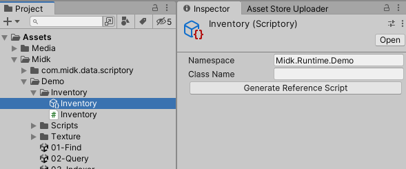

## 1.2 Window

Double-clicking on the Scriptory asset opens the Scriptory Window.

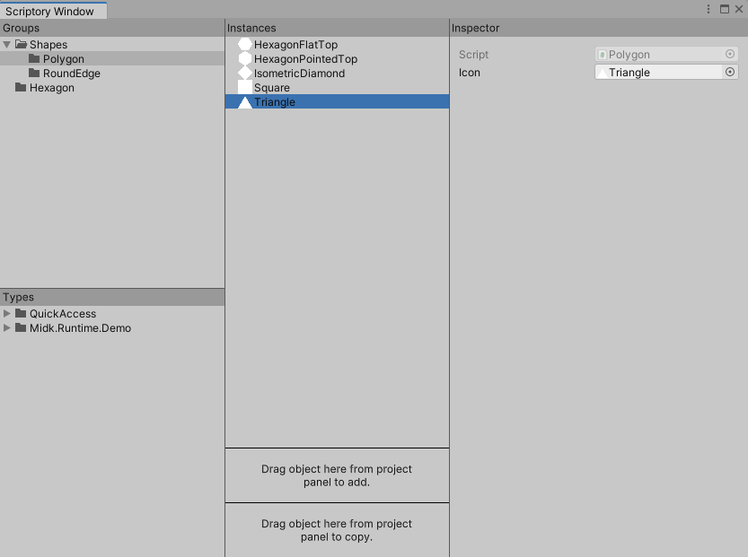

**1. Groups**

It is used to display the current folder structure. The right-click menu can add new folders, rename, and delete folders. Press and hold the left button to drag the folder to move the location.

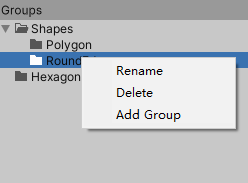

**2. Types**

By default, the type inherited from ScriptoryObject is displayed. Dragging the selected type to the Instances window will create an instance of this type in the selected folder, and the created instance will be saved as a sub-asset of the corresponding Scriptory asset.

The right-click menu can refresh this list, or display types inherited from ScriptableObject. The displayed list includes types inherited from ScriptoryObject. These types can also be dragged to the Instances window to create instances.

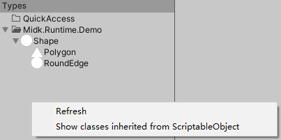

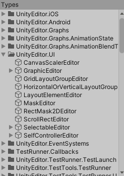

> Select the C# file where the type inherited from ScriptoryObject is located, and the default Icon can be set in the Inspector window, and the icon set here will be displayed in the Types window.
>
> Do not instantiate unknown scripts that inherit from ScriptableObject, as this may cause the settings of the editor or plug-in to be modified abnormally and an error will be reported.

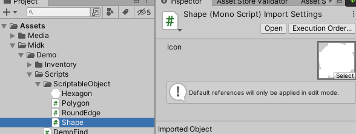

Right-click on a type to add the type to the QuickAccess folder.

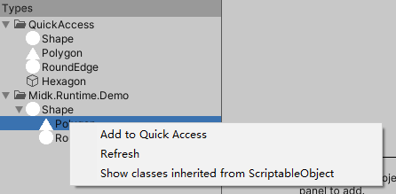

Right-click on a type in the QuickAccess folder to remove the type.

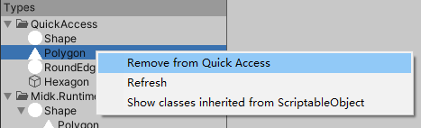

**3. Instances**

Display the game assets contained in the selected folder, click the blank space in the Groups window to select the root folder.

The right-click menu contains the following functions:

* Rename.
* Show or hide corresponding subassets in the Project window.
* Delete the corresponding subasset.
* Refresh.
* Select the script corresponding to the asset type.
* Select an asset, if the corresponding asset is hidden, it will be displayed first.

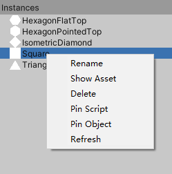

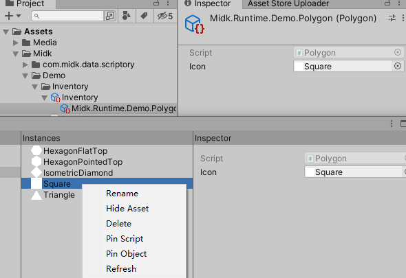

eft-click and drag to the folder on the Groups window to change the parent folder of this instance, dragging to the blank space of the Groups window will modify the parent folder as the root folder. Drag and drop onto a variable field that can receive this instance type to assign a value to the variable.

Drag the left button to other instances in this window to move the position in this folder. When the mouse pops up, the dragged instance will be moved above or below the selected instance according to the position.

There are two areas at the bottom of the Instances window, and assets in the Project window can be dragged to these two areas to add them to the Scriptory assets. Dragging to the Add area will directly add the dragged asset to the Scriptory asset, and dragging to the Copy area will add the copy of the dragged asset to the Scriptory asset. By default, these two areas only accept assets inherited from ScriptableObject. Multiple assets can be dragged and dropped at the same time. When the dragged assets include acceptable assets, the corresponding area will turn blue and the pointer style will also change. Do not add assets that contain subassets this way.

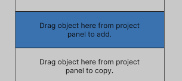

The right-click menu options in these two areas can set the received assets from assets inherited from ScriptableObject to assets inherited from UnityEngine.Object, please use this function with caution.

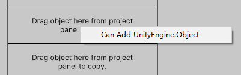

**4. Inspector**

The displayed content is consistent with the content of the Inspector window in the editor. Because of Unity's built-in format, some layouts with Foldout elements will be slightly different.

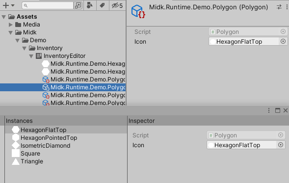

Right-click the menu to select the script of the instance type and select the instance.

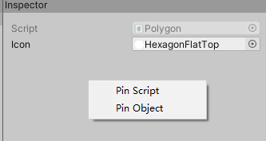

The type inherited from ScriptoryObject modifies the icon displayed in the Instances window by modifying the value of Icon in this window. After modification, you need to right-click and refresh in the Instances window to refresh the icon.

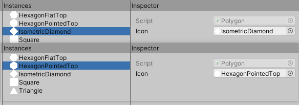

Types inherited from ScriptableObject will display a Select Icon in the Instances window.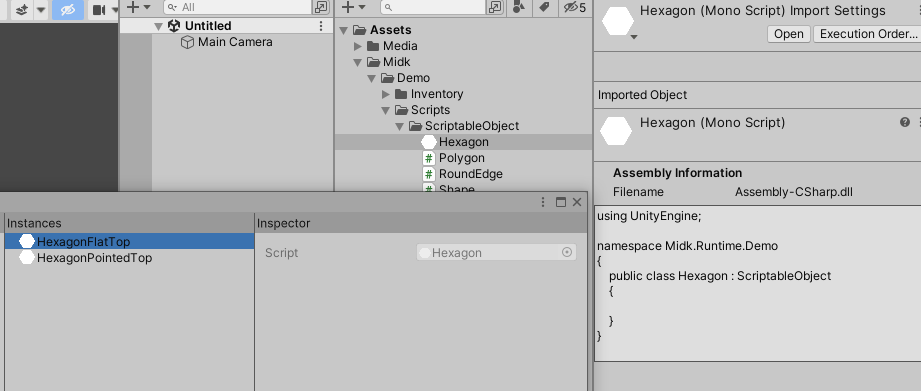

# 2 Coded

Reference the Scriptory asset in your script, and then use this asset to find subassets.

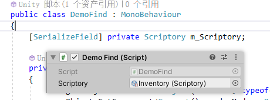

Sub-assets can be searched by various methods such as path, type, name, and index.

**1. Public Property**

Scriptory:

~~~c#
public ScriptoryGroup RootGroup;
~~~

ScriptoryGroup:

~~~c#
public List<UnityEngine.Object> ChildObjectList; // excluding assets under subfolders
~~~

**2. Find by path**

Find folder by path:

* Find from root folder:

  ~~~c#
  public ScriptoryGroup Scriptory.FindGroup(string path);
  public ScriptoryGroup ScriptoryGroup.FindGroup(string path);
  ~~~

* Find from current folder:

  ~~~c#
  public ScriptoryGroup ScriptoryGroup.FindGroupRelative(string path);
  ~~~

~~~c#
ScriptoryGroup polygon = m_Scriptory.FindGroup("Shapes.Polygon");

ScriptoryGroup shapes = m_Scriptory.FindGroup("Shapes");
ScriptoryGroup polygon = shapes.FindGroupRelative("Polygon");
~~~

Find assets by path:

* Find from root folder:

  ~~~c#
  public Object Scriptory.FindObject(string path);
  public Object ScriptoryFolder.FindObject(string path);
  ~~~

* Find from current folder:

  ~~~c#
  public Object ScriptoryFolder.FindObjectRelative(string path);
  ~~~

~~~c#
Polygon triangle = m_Scriptory.FindObject("Shapes.Polygon.Triangle") as Polygon;
Polygon triangle = m_Scriptory.FindFolder("Shapes").FindObject("Shapes.Polygon.Triangle") as Polygon;
Polygon triangle = m_Scriptory.FindFolder("Shapes").FindObjectRelative("Polygon.Triangle") as Polygon;
Polygon triangle = m_Scriptory.FindFolder("Shapes.Polygon").FindObjectRelative("Triangle") as Polygon;
~~~

**3. Find by type and name**

Find from root folder:

~~~c#
public List<T> Scriptory.Query<T>(string name = null) where T : UnityEngine.Object;
public T Scriptory.Q<T>(string name = null) where T : UnityEngine.Object;
~~~

Find from current folder:

~~~c#
public List<T> ScriptoryFolder.Query<T>(string name = null) where T : UnityEngine.Object;
public T ScriptoryFolder.Q<T>(string name = null) where T : UnityEngine.Object;
~~~

Among them, Query is to query all eligible objects, and Q is to find the first eligible object. When the name is empty, it is only searched by type.

~~~c#
List<Shape> shapes = m_Scriptory.Query<Shape>();
List<Shape> polygon = m_Scriptory.FindFolder("Shapes.Polygon").Query<Shape>();
Shape triangle = m_Scriptory.Q<Shape>("Triangle");
~~~

**4. Lookup by index**

Find folder:

~~~c#
ScriptoryFolder shapes = m_Scriptory[Inventory.Shapes.index];
ScriptoryFolder polygon = m_Scriptory[Inventory.Shapes.Polygon.index];
~~~

Find subasset objects:

~~~c#
Shape triangle = m_Scriptory[Inventory.Shapes.Polygon.Triangle] as Shape;
Shape circle = m_Scriptory[Inventory.Shapes.Circle] as Shape;
~~~

**Index script generated in Demo**:

~~~c#
//------------------------------------------------------------------------------
// <auto-generated>
//     This code was auto-generated by Scriptory
//     version 2.0.0
//     from Assets/Midk/Demo/Inventory/Inventory.asset
//
//     Changes to this file may cause incorrect behavior and will be lost if
//     the code is regenerated.
// </auto-generated>
//------------------------------------------------------------------------------

namespace Midk.Runtime.Demo
{
    public class Inventory
    {
        public const int index = 0;
        public class Shapes
        {
            public const int index = 1;
            public const long _9Sliced = 0;
            public const long Capsule = 1;
            public const long Circle = 2;
            public const long HexagonFlatTop = 3;
            public const long HexagonPointedTop = 4;
            public const long IsometricDiamond = 5;
            public const long Square = 6;
            public const long Triangle = 7;
            public class Polygon
            {
                public const int index = 3;
                public const long HexagonFlatTop = 8;
                public const long HexagonPointedTop = 9;
                public const long IsometricDiamond = 10;
                public const long Square = 11;
                public const long Triangle = 12;
            }
            public class RoundEdge
            {
                public const int index = 4;
                public const long _9Sliced = 13;
                public const long Capsule = 14;
                public const long Circle = 15;
            }
        }
        public class Hexagon
        {
            public const int index = 2;
            public const long HexagonFlatTop = 16;
            public const long HexagonPointedTop = 17;
        }
    }
}
~~~
